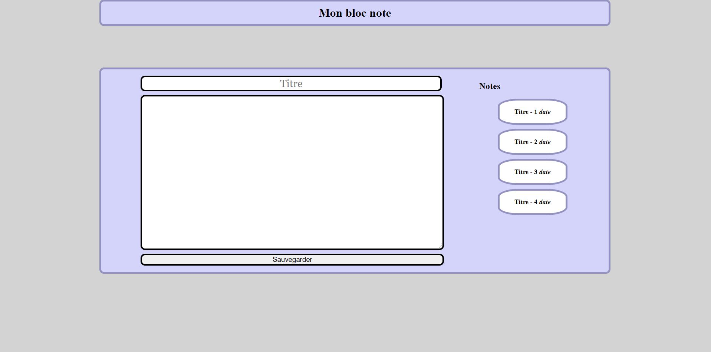
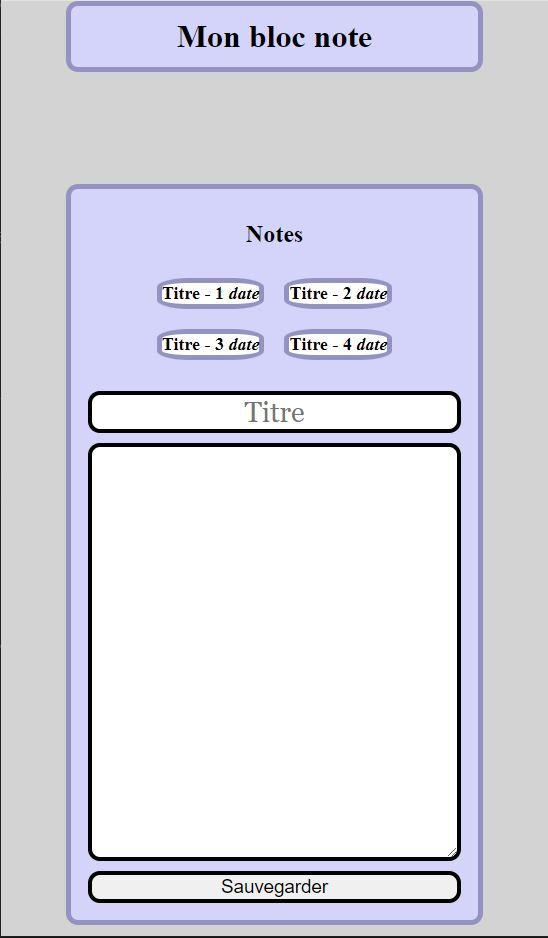

# 1ère partie : QCM

Remplissez le QCM suivant :

https://forms.gle/WA7Gcad2f5b4tki68

# 2ème partie : Projet - Prise de notes

Terminez ce projet de prise de note et de gestion des notes.

## Procédure 
- Cloner ce projet en local
- créer une branche `Nom_Prénom`
- Réaliser le projet
- Une fois terminé pousser la branche

## 1 - Style

Compléter le style pour que la page ressemble à l'image suivante

## 2 - Responsive

Faire qu'en dessous de 768px de largeur on affiche la page suivant cette disposition :

## 3 - Javascript

### Sauvegarde

Ecrire le code JS qui permet de sauvegarder le `titre` de la note ainsi que le `contenu` de la note, lors du click sur le bouton `Sauvegarder`, en créant un nouvel item dans la liste des notes.

### Récupération

En cliquant sur un item de la liste des notes, celà réapplique dans le champs `titre` et dans le `contenu` ce qui avait été sauvegarder.

## 4 - Plus
- Conserver les informations en local storage
- Ajouter un bouton permettant la remise à zéro du local storage
- permettre de supprimer individuellemnt chaque note de la liste
- Créer une autre page qui liste les différentes notes.